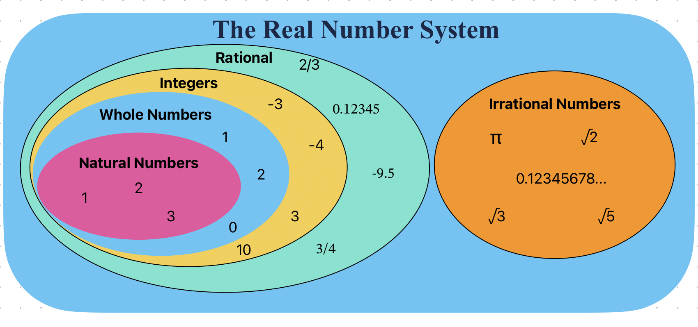
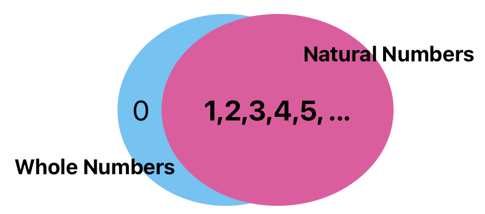
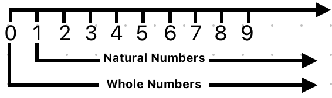
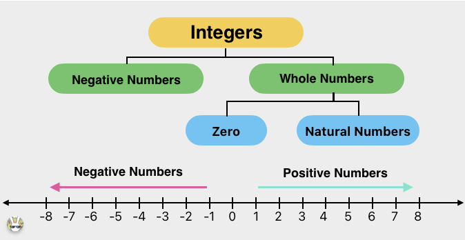
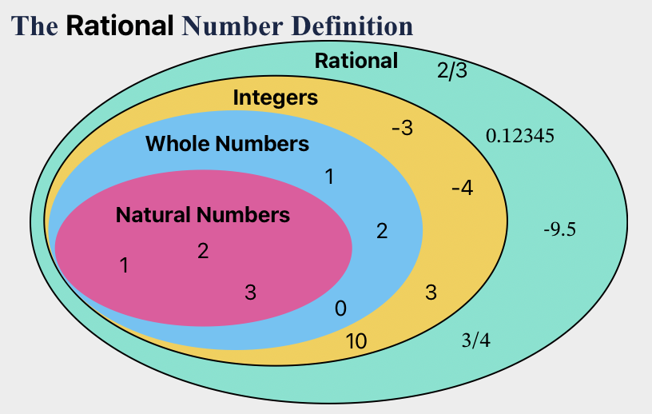
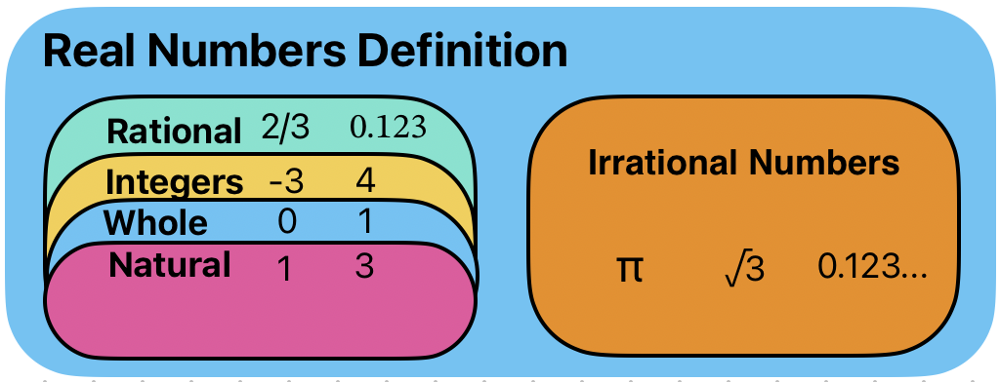
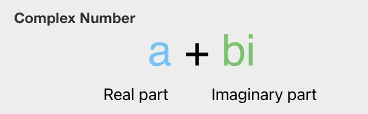

# Number

  

## Natural Numbers
The **natural numbers** are the [numbers](https://en.wikipedia.org/wiki/Number "Number") 1, 2, 3, etc., possibly including 0 as well.

The natural numbers start with 0, corresponding to the **non-negative integers** 0, 1, 2, 3, ..., whereas others start with 1, corresponding to the **positive integers**  1, 2, 3, ...

The natural numbers can be used for counting (as in "there are _six_ coins on the table"), in which case they serve as _[cardinal numbers](https://en.wikipedia.org/wiki/Cardinal_number "Cardinal number")_. They may also be used for ordering (as in "this is the _third_ largest city in the country"), in which case they serve as _[ordinal numbers](https://en.wikipedia.org/wiki/Ordinal_number "Ordinal number")_. Natural numbers are sometimes used as labels, known as _[nominal numbers](https://en.wikipedia.org/wiki/Nominal_number "Nominal number")_, having none of the properties of numbers in a mathematical sense (e.g. sports [jersey numbers](https://en.wikipedia.org/wiki/Number_(sports) "Number (sports)")).[[3]](https://en.wikipedia.org/wiki/Natural_number#cite_note-:1-4)[[6]](https://en.wikipedia.org/wiki/Natural_number#cite_note-8)

-  Set of Natural Numbers: **N** = {1, 2, 3, 4, 5, 6, 7, 8, 9,…}

    <!--  -->
```{image} ../../images/w_vs_N.png
:alt: fishy
:class: bg-primary mb-1
:width: 70%
:align: center
```

## Whole Numbers

Whole numbers are a set of numbers including all **natural numbers** and **0**

-  Set of Whole Numbers: **W** = {0, 1, 2, 3, 4, 5, 6, 7, 8, 9, 10……}

<!--  -->
```{image} ../../images/w_number.png
:alt: fishy
:class: bg-primary mb-1
:width: 70%
:align: center
```

## Integers

Integers include `positive` and `negative` **whole numbers** as well as **0**. In In the language of mathematics, the set of integers is often denoted by the boldface **Z** 

-   Set of Integers:  **Z** = {….-9, -8, -7, -6, -5, -4, -3, -2, -1, 0, 1, 2, 3, 4, 5, 6, 7, 8, 9,…}
    <!--  -->
```{image} ../../images/p_vs_n_interger.png
:alt: fishy
:class: bg-primary mb-1
:width: 70%
:align: center
```

## Rational Numbers


a **rational number** is a [number](https://en.wikipedia.org/wiki/Number "Number") that can be expressed as the [quotient](https://en.wikipedia.org/wiki/Quotient "Quotient") or [fraction](https://en.wikipedia.org/wiki/Fraction_(mathematics) "Fraction (mathematics)")   of two [integers](https://en.wikipedia.org/wiki/Integer "Integer"), a [numerator](https://en.wikipedia.org/wiki/Numerator "Numerator")  pand a non-zero [denominator](https://en.wikipedia.org/wiki/Denominator "Denominator")  q.[[1]](https://en.wikipedia.org/wiki/Rational_number#cite_note-Rosen-1) 

For example,  is a rational number, as is every integer (e.g. 5 = 5/1). The [set](https://en.wikipedia.org/wiki/Set_(mathematics) "Set (mathematics)") of all rational numbers, also referred to as "**the rationals**",[[2]](https://en.wikipedia.org/wiki/Rational_number#cite_note-2) the **field of rationals**[[3]](https://en.wikipedia.org/wiki/Rational_number#cite_note-3) or the **field of rational numbers** is usually denoted by boldface **Q**,[[4]](https://en.wikipedia.org/wiki/Rational_number#cite_note-4) or [blackboard bold](https://en.wikipedia.org/wiki/Blackboard_bold "Blackboard bold")  [[5]](https://en.wikipedia.org/wiki/Rational_number#cite_note-5)


<!--  -->
```{image} ../../images/The_Rational_Number_Definition.png
:alt: fishy
:class: bg-primary mb-1
:width: 70%
:align: center
```

## Irrational Numbers
Irrational numbers cannot be expressed as a fraction (That is, irrational numbers cannot be expressed as the ratio of two integers. 
When the ratio of lengths of two line segments is an irrational number, the line segments are also described as being incommensurable, meaning that they share no "measure" in common, that is, there is no length ("the measure"), no matter how short, that could be used to express the lengths of both of the two given segments as integer multiples of itself.

Among irrational numbers are the ratio π of a circle's circumference to its diameter, Euler's number e, the golden ratio φ, and the square root of two.[1] In fact, all square roots of natural numbers, other than of perfect squares, are irrational.[2]). This includes the famous Pi , square roots of certain numbers like , and Euler’s number which we will learn about later. These numbers have an infinite number of decimal digits, such as :


>The common examples of irrational numbers are pi(π=3⋅14159265…), √2, √3, √5, Euler’s number (e = 2⋅718281…..), 2.010010001….,etc.


## Real Numbers

Real numbers include **rational** as well as **irrational numbers**. In practicality, when you are doing any data science work you can treat any decimals you work with as real numbers.

<!--  -->
```{image} ../../images/Real_Numbers_Definition.png
:alt: fishy
:class: bg-primary mb-1
:width: 70%
:align: center
```

## Complex and Imaginary Numbers
The numbers which are not real are imaginary numbers. When we square an imaginary number, it gives a negative result. It is represented as Im().

>Example: √-2, √-7, √-11 are all imaginary numbers

The complex numbers were introduced to solve the equation `x2+1 = 0`. The roots of the equation are of form `x = ±√-1` and no real roots exist. Thus, with the introduction of complex numbers, we have Imaginary roots.

We denote `√-1` with the symbol `I`, which denotes Iota (**Imaginary number**).

The **complex number** is basically the combination of a real number and an imaginary number. The complex number is in the form of **a+ib,** where `a = real number` and `ib = imaginary number`. Also, a,b belongs to real numbers and `i =  √-1.`

Hence, a complex number is a simple representation of addition of two numbers, i.e., real number and an imaginary number. One part of it is purely real and the other part is purely imaginary.

<!--  -->
```{image} ../../images/Complex_Number.png
:alt: fishy
:class: bg-primary mb-1
:width: 70%
:align: center
```